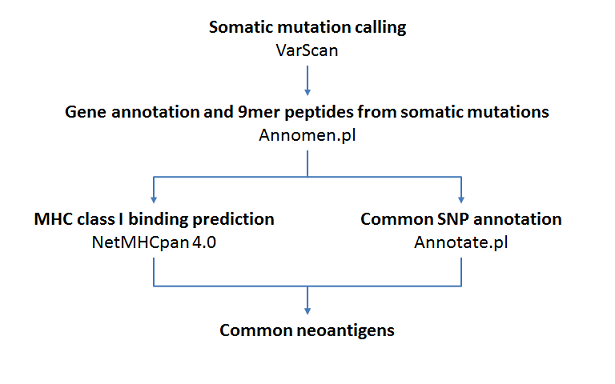

# Deep-neoantigen
Identification of missing neoantigen for accurate prediction of immunotherapy response


## Requirements

1. Perl - https://www.perl.org
2. Annomen - https://github.com/jiwoongbio/Annomen
3. Perl module Bio::DB::Fasta - https://metacpan.org/pod/Bio::DB::Fasta
4. Samtools - http://www.htslib.org
5. VarScan2 - http://dkoboldt.github.io/varscan/
6. netMHCpan 4.0 - http://www.cbs.dtu.dk/cgi-bin/nph-sw_request?netMHCpan
7. Linux commands: sort, cat, cut, wget - https://www.gnu.org/software/wget/


## Install

If you already have Git (https://git-scm.com) installed, you can get the latest development version using Git. It will take a few seconds.
```
git clone https://github.com/jiwoongbio/Deep-neoantigen.git
```


## Analysis workflow




## Analysis commands

```
# Samtools mpileup
samtools mpileup -q 1 -f hg19.fasta -B normal.bam tumor.bam > normal_tumor.mpileup

# VarScan
java -jar VarScan.jar somatic normal_tumor.mpileup varscan --mpileup 1
java -jar VarScan.jar processSomatic varscan.snp
java -jar VarScan.jar processSomatic varscan.indel

# VarScan to VCF
perl varscan2vcf.pl varscan.{snp,indel}.Somatic > varscan.somatic.vcf

# Prepare dbSNP150
wget http://hgdownload.soe.ucsc.edu/goldenPath/hg19/database/snp150.txt.gz
gzip -dc snp150.txt.gz | perl dbsnp_allele.pl - hg19.fasta 2> snp150_allele.log | perl Annomen/sort_by_reference.pl -h - hg19.fasta 0 1 2 > snp150_allele.txt

# Annomen: variant annotation (RefSeq genes, dbSNP150)
perl Annomen/leftalignIndel.pl varscan.somatic.vcf hg19.fasta | perl Annomen/sort_by_reference.pl -c - hg19.fasta 0 1 \
	| perl Annomen/Annomen.pl -p 9 - hg19.fasta Annomen/Annomen_table.hg19.txt Annomen/human.rna.fna Annomen/human.protein.faa \
	| perl Annomen/Annotate.pl - hg19.fasta snp150_allele.txt snp150 name subset alleleN alleleFreq \
	> varscan.somatic.annotated.vcf

# Annomen: generate variant tables
grep -v '^#' varscan.somatic.annotated.vcf | cut -f1-8 | perl Annomen/vcf.table.pl -p - `cut -f2 column.annotation.txt | tr '\n' ',' | sed 's/,$//'` | bash -c "cat <(cut -f1 column.annotation.txt | tr '\n' '\t' | sed 's/\t$/\n/' | sed 's/^/#/') -" > varscan.somatic.annotation.txt

# netMHCpan: MHC class I binding prediction of mutation peptides
cut -f14 varscan.somatic.annotation.txt | awk '(NR > 1)' | sed 's/,/\n/g' | grep -v '^$' | grep -v '*$' | sort -u > varscan.somatic.peptide.txt
for hla in $(sort -u HLA_allele.txt); do perl netMHCpan_peptide.pl varscan.somatic.peptide.txt $hla; done > varscan.somatic.netMHCpan.txt

# Join variant annotation and netMHCpan output
perl table.delimitLines.pl varscan.somatic.annotation.txt 13 | perl table.addColumns.pl -m - 13 "echo -en 'Mutation peptides\t\tHLA allele\tnetMHCpan\n' | cat - varscan.somatic.netMHCpan.txt |" 0 2,3 > varscan.somatic.annotation.netMHCpan.txt
```


## Command usages

* varscan2vcf.pl
```
Usage:   perl varscan2vcf.pl [options] varscan.{snp,indel}.Somatic [...] > varscan.somatic.vcf

Options: -h       display this help message
         -n STR   normal sample name [normal]
         -t STR   tumor sample name [tumor]
```

* dbsnp_allele.pl
```
Usage:   perl dbsnp_allele.pl [options] snp.txt reference.fasta > snp.allele.txt

Options: -h       display this help message
```

* netMHCpan_peptide.pl
```
Usage:   perl netMHCpan_peptide.pl [options] peptide.txt HLA_allele [...] > netMHCpan.txt

Options: -h       display this help message
```
